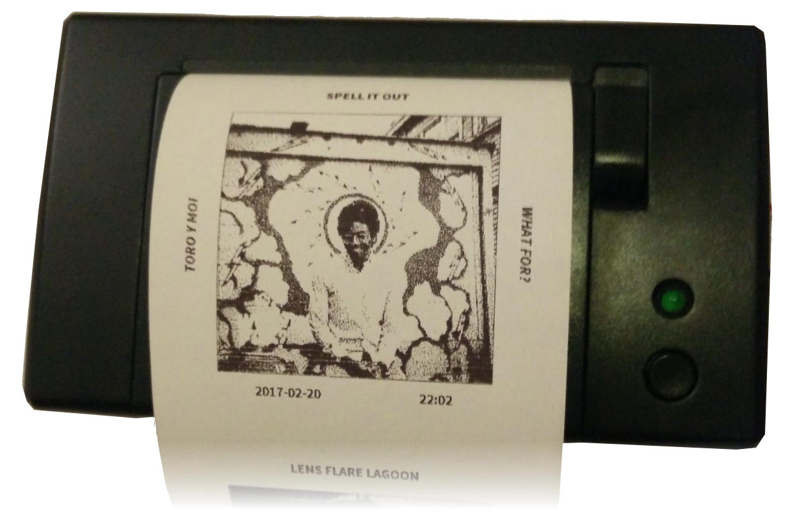
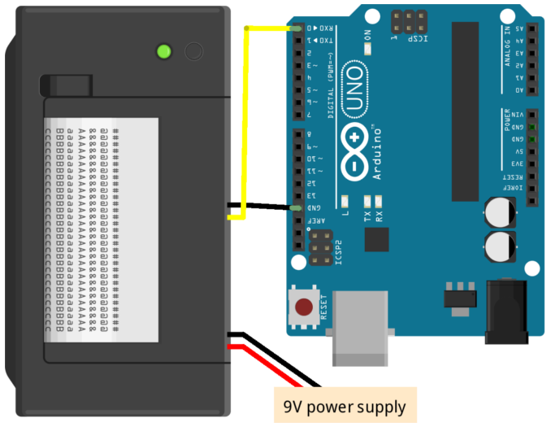

# now playing printer

_🎧🔥🖨️🖼️ print out the album art music you're currently listening to_

Uses Last.fm to get the tracks you're listening to and then prints them out on a thermal receipt printer.



*here's a vid of it working: https://www.youtube.com/watch?v=ElmxS7iTNQ4*

*I did a talk about this, here are my slides: https://docs.google.com/presentation/d/1gCsklfmLf14PuasJexWyZcEoaQp72HyZ2LuIPDJe1Ys/edit*

## what you need

 + [thermal printer](http://www.hobbytronics.co.uk/thermal-printer)
 + 57mm thermal paper
 + Arduino Uno (Works with other devices that can use serial port too use the corresponding RX and TX)
 + [Arduino IDE](https://www.arduino.cc/en/Main/Software)
 + some jumper wires
 + 9V power supply (splice wires and shove into thermal printer)
 + [Last.fm API key](http://www.last.fm/api)

## installation

 1. upload the `StandardFirmata` example code to your Arduino Uno (`File/Examples/Firmata/StandardFirmata` -> `Upload`)
 2. [set-up your thermal printer](https://learn.adafruit.com/mini-thermal-receipt-printer)

 

 > you will probably need to tweak the settings for your printer, [see the thermalprinter module comments](https://github.com/xseignard/thermalPrinter/blob/master/src/printer.js#L12)
 3. add environment variables. (Copy `.env-sample` to `.env`)

```
 LASTFM_API= # sign-up for a key at http://www.last.fm/api
 LASTFM_SECRET= # also at http://www.last.fm/api
 LASTFM_USERAGENT= # this is to tell last.fm who is requesting info
 LASTFM_USERNAME= # your last fm username to track what music is playing

 PRINTER_USB= # this is where the arduino is mounted at, see your Arduino IDE (Tools/Port)
 PRINTER_BAUDRATE= # hold the power button and plug the power in, the baudrate is printed on the test page
 PRINTER_ROTATION= # this changes the orientation of the print, 180 is upside down for example
```

 4. install non-node dependencies: [GraphicsMagick](http://www.graphicsmagick.org/)

 ```
 sudo apt-get update
 sudo apt-get install graphicsmagick
 ```

 5. install node dependencies

 ```
 npm install
 ```

## run

listen to music and then run the script:

```
sudo node main.js
```

everytime Last.fm picks up a new song streaming it'll print it out!

> you probably need to run a root to get access to the USB port
